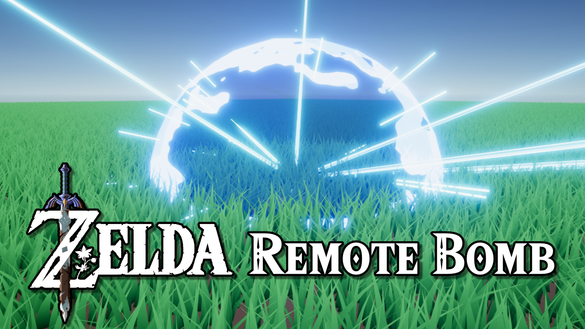

# Zelda: Breath of the Wild's Remote Bomb in Unity Shader Graph & VFX Graph

A shader and visual effect made in Unity to recreate the remote bomb from *Zelda: Breath of the Wild*.

## Overview

This repository contains a bomb shader made with Shader Graph which imitates the style of bomb explosion seen in *Breath of the Wild*, along with a visual effect made with VFX Graph which models the particles that go with the explosion. Both halves of the effect are synchronized using an animation clip and a couple of scripts.

## Software

This project was created using Unity 2020.3.21f1 and Shader Graph/URP 10.6.0.

## Tutorials

Coming soon!

## Authors

This project and the corresponding tutorial was created by Daniel Ilett.

## Release

This project was released on January 17th 2022.
